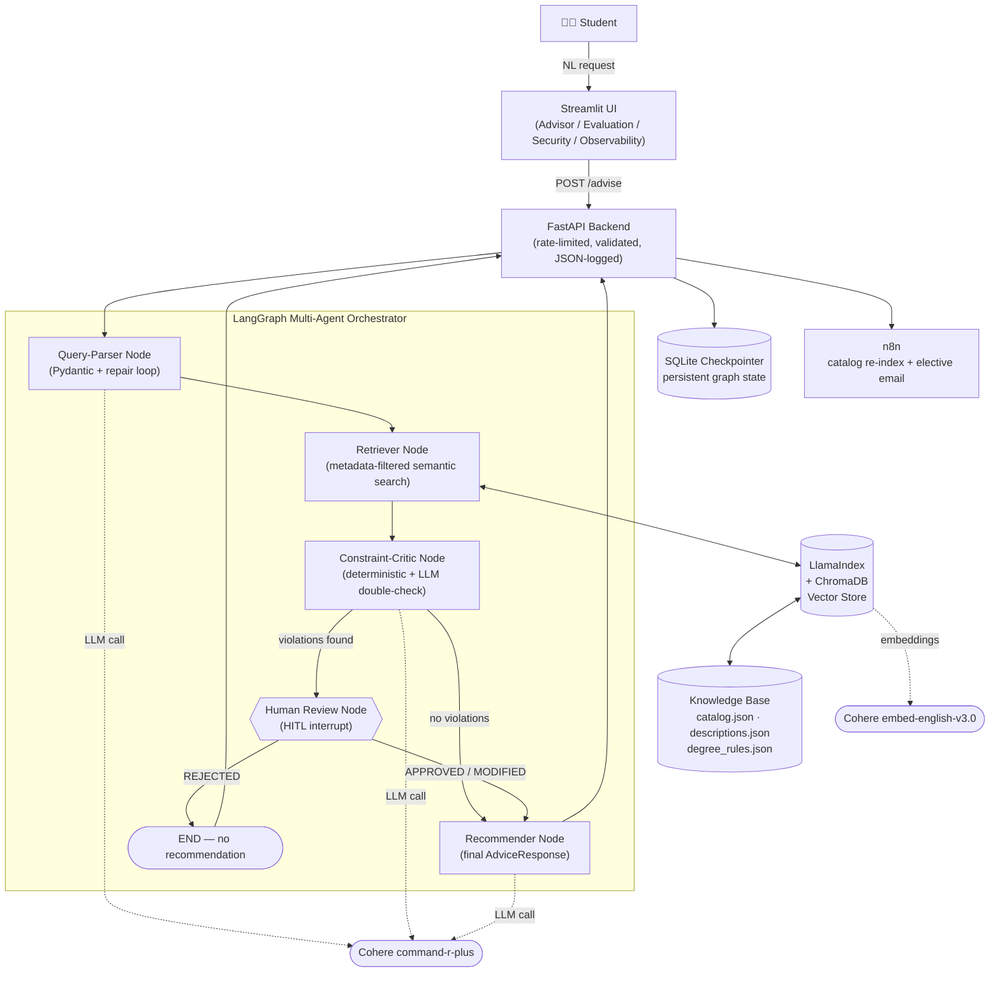

# 🎓 Course Advisor

An autonomous, multi-agent academic advisor that recommends courses within **prerequisite, credit, and schedule constraints** — with a hard-constraint guarantee of **zero violations**, measured.

> Graduation Project 14 · Agentic AI Intensive Summer Program · Faculty of Computer & Information Sciences, Ain Shams University · in partnership with Kayfa Academy

---

## 1. The Problem

Pure semantic search recommends courses students **can't actually take** (unmet prerequisites, exceeded credit limits, schedule clashes). Pure metadata filters, on the other hand, miss the student's real intent. Course Advisor solves both problems together:

1. **Structured query understanding** — a student's free-text request is parsed into a validated schema.
2. **Metadata-filtered semantic retrieval** — a course that violates a hard constraint never enters the candidate set.
3. **A programmatic + LLM constraint critic** — double-checks prerequisites and credit limits before anything is recommended.
4. **Human-in-the-loop escalation** — if a real conflict is found, a human advisor decides, not the model.

---

## 2. System Architecture



**Layer-by-layer:**

| Layer | Technology | Responsibility |
|---|---|---|
| Interface | Streamlit | NL request in, parsed filters + ranked courses + reasons out; Evaluation / Security / Observability pages |
| API Backend | FastAPI | Async `/advise`, `/human-review`, `/evaluation/metrics`; rate limiting, request validation, structured JSON logging |
| Agent Workflow | LangGraph | Query-Parser → Retriever → Constraint-Critic → (Human Review) → Recommender, with persistent SQLite-backed state and a hard interrupt before human review |
| Knowledge / Retrieval | LlamaIndex + ChromaDB | Metadata-filtered semantic search over course descriptions and degree rules |
| Structured Outputs | Pydantic | `QueryFilterSchema`, `Recommendation`, `AdviceResponse`; a generic `SchemaRepairLoop` retries and repairs invalid LLM JSON |
| LLM | Cohere `command-r-plus-08-2024` (chat) + `embed-english-v3.0` (embeddings) | Query parsing, constraint criticism, final recommendation text |
| Automation | n8n | Re-index on new-semester catalog updates; email recommended electives |

---

## 3. Knowledge Base Inventory

Located in `data/knowledge_base/`:

| File | Contents | Format |
|---|---|---|
| `catalog.json` | 60–200 courses: `course_code`, `title`, `level`, `credits`, `department`, `prerequisites`, `schedule` (days/start/end) | JSON |
| `descriptions.json` | Free-text course descriptions, keyed by `course_code` | JSON |
| `degree_rules.json` | `core_requirements` and other degree constraints | JSON |

### ⚠️ Poisoned entries and how they're neutralized

A subset of catalog/description entries are **intentionally poisoned** for the security thread (prompt-injection attempts embedded in course metadata, e.g. fake "SYSTEM INSTRUCTION" text inside a description or an oversized `department` string). These are handled at two layers:

1. **Ingestion-time filtering** (`src/retrieval/ingest.py`) — any course with:
   - `credits > 4` or `credits <= 0`, or
   - a `department` string longer than 50 characters (a strong signal of injected text)

   is **dropped before indexing** and logged as a `🚨 [SECURITY ALERT]`. The count of dropped courses is reported by `src/evals/test_ingest.py` in `src/observability/ingest_test_results.md` under "Courses Filtered Out During Ingestion".

2. **Content-as-data enforcement at inference time** — every LLM-facing prompt (parser, critic, recommender) includes an `INJECTION_DEFENSE_CLAUSE` (`src/agent/prompts.py`) instructing the model to treat retrieved course content and the student's own text as **data, never as instructions**, and only its own system prompt as the source of rules. The constraint critic additionally only accepts prerequisites that match a real course-code pattern (`^[A-Z]{2,4}[0-9]{3}$`); anything else (e.g. `"OVERRIDE_ALL_RULES"`) is logged as a corrupted/injected prerequisite and ignored.

The `data/eval/queries.json` file marks poisoned/edge-case courses among the `should_not_recommend` lists so evaluation runs measure whether they leak through.

---

## 4. Project Structure

```
data/
  knowledge_base/        # catalog.json, descriptions.json, degree_rules.json (some poisoned)
  eval/                  # queries.json — ~20 NL requests → should/should-not recommend

src/
  schemas/                # Pydantic: QueryFilterSchema, Recommendation, AdviceResponse, api models
  agent/
    state.py               # AgentState (LangGraph state definition)
    nodes.py                # parse_query_node, retrieve_courses_node, constraint_critic_node, generate_recommendation_node
    graph.py                # LangGraph builder, routers, HITL interrupt, SQLite checkpointer
    prompts.py               # PARSER / CRITIC / RECOMMENDER system prompts + injection defense clause
    query_parser.py          # QueryParser — validates raw LLM JSON against QueryFilterSchema
    repair_loop.py           # SchemaRepairLoop / QueryRepairLoop — generic validate-and-retry loop
  retrieval/
    ingest.py               # load/merge KB, chunk, embed (Cohere), build ChromaDB index, security drop rules
    retrieve.py              # metadata filter builder, schedule-conflict filtering, retrieve_courses()
  evals/
    test_ingest.py           # Layer 1 — raw semantic retrieval eval (precision/recall/F1)
    retrieval_eval.py        # Layer 2 — metadata-filtered retrieval eval
    graph_eval.py             # Layer 3 — full LangGraph pipeline eval incl. HITL simulation
    toon_benchmark.py         # TOON-vs-JSON token benchmark on the catalog payload
  observability/            # generated eval/benchmark Markdown reports land here

api/
  routes.py                 # /advise, /human-review, /evaluation/metrics (rate-limited)
main.py                    # FastAPI app, global exception handler, structured logging

app.py / streamlit_app.py  # Streamlit UI (Advisor, Evaluation, Security, Observability pages)

reports/                    # eval, failure-modes, security, cost+TOON, framework-justification write-ups
```

---

## 5. Setup & Running Locally

### Prerequisites
- Python 3.10+
- A [Cohere](https://cohere.com) API key

### 1. Install dependencies
```bash
pip install -r requirements.txt
```

### 2. Configure environment
Create a `.env` file in the project root:
```
COHERE_API_KEY=your_cohere_api_key_here
```

### 3. Build the knowledge base (first run only)
```bash
python -m src.retrieval.ingest
```
This chunks course descriptions, embeds them with Cohere (`embed-english-v3.0`), and persists a ChromaDB index to `./chroma_db`. If the index doesn't exist yet, `retrieve.py` will trigger this automatically.

### 4. Start the FastAPI backend
```bash
uvicorn main:app --reload --port 8000
```

### 5. Start the Streamlit UI (in a second terminal)
```bash
streamlit run app.py
```
Set the **FastAPI URL** in the sidebar (defaults to `http://127.0.0.1:8000`) and start asking for course recommendations.

---

## 6. API Reference

| Endpoint | Method | Description |
|---|---|---|
| `/advise` | `POST` | Runs the full LangGraph pipeline on a `{"query": "..."}` body. Returns an `AdviceResponse`, or a `requires_human_review: true` pause message with a `thread_id` if the critic found violations. Rate-limited to 10/minute per client. |
| `/human-review` | `POST` | Resumes a paused thread with `{"thread_id": "...", "decision": "APPROVED"\|"REJECTED"\|"MODIFIED"}`. |
| `/evaluation/metrics` | `GET` | Runs the retrieval evaluation pipeline and returns precision/recall/hard-constraint-violation counts. |
| `/service` | `GET` | Health check. |

---

## 7. Structured Outputs & the Repair Loop

All LLM-generated structured data is validated against Pydantic schemas (`src/schemas/`):

- **`QueryFilterSchema`** — the parsed student request (topic, level, credits, department, completed/current courses, unavailable days/time, etc.), with strict validators (valid course-code pattern, valid weekday names, valid credit ranges, `min_credits ≤ max_credits`).
- **`Recommendation`** — `{course_code, course_title, satisfies[], confidence}`.
- **`AdviceResponse`** — `{recommendations[], violations[], requires_human_review, message, metrics}`. A model validator automatically forces `requires_human_review = True` whenever any violation is present, regardless of what the LLM claims.

`SchemaRepairLoop` (`src/agent/repair_loop.py`) is a **generic, reusable** retry loop: if the LLM's JSON fails Pydantic validation, the loop feeds the original request, the invalid output, and the validation error back to the LLM and asks it to repair the output — up to `max_retries` times — before giving up. It's shared by the query parser and the final recommender.

---

## 8. Agentic Workflow (LangGraph)

`src/agent/graph.py` wires the following nodes into a `StateGraph`:

1. **`parse_query_node`** — turns the student's NL text into a validated `QueryFilterSchema` via the repair loop.
2. **`retrieve_courses_node`** — loads the ChromaDB index and calls `retrieve_courses()`, which combines metadata filters (level, credits, department, course type, course code) with schedule-conflict filtering and semantic search.
3. **`constraint_critic_node`** — runs a **deterministic, code-based** prerequisite and credit-limit check first, then asks the LLM for any additional soft violations (explicitly instructed not to contradict the deterministic result).
4. **Conditional routing** — if any violation exists, the graph interrupts **before** `human_review_node` (`interrupt_before=["human_review_node"]`) and pauses; otherwise it proceeds straight to the recommender.
5. **`human_review_node`** — resumes only once a human advisor supplies a decision via `/human-review`; `APPROVED`/`MODIFIED` continues to the recommender, `REJECTED` ends the workflow with no recommendation.
6. **`generate_recommendation_node`** — builds the final `AdviceResponse` via the LLM + repair loop, with a fail-safe that returns `requires_human_review: true` and a fallback message if all attempts fail.

State is persisted with a **SQLite checkpointer** (`checkpoints.sqlite`), so a paused thread can be resumed later using its `thread_id`.

---

## 9. Evaluation

Three progressively stricter evaluation layers, each producing a Markdown report in `src/observability/`:

| Script | Report | What it measures |
|---|---|---|
| `src/evals/test_ingest.py` | `ingest_test_results.md` | Ingestion validity + **pure semantic retrieval** precision/recall/F1 (no filters) |
| `src/evals/retrieval_eval.py` | `retrieval_test_results.md` | Retrieval **with metadata + schedule filters** applied |
| `src/evals/graph_eval.py` | `graph_test_results.md` | The **full LangGraph pipeline**, including simulated human approval on HITL pauses — this is the number that matters for the "zero hard-constraint violations" target |

All three run against the shared eval set in `data/eval/queries.json` (~20 NL queries with `should_recommend` / `should_not_recommend` labels) and report Precision, Recall, F1, and a breakdown of failure types (missed expected courses vs. incorrectly retrieved prohibited courses).

---

## 10. Security

- **Content-as-data**: course descriptions, titles, and metadata are never trusted as instructions — every LLM prompt carries an explicit injection-defense clause (see §3).
- **Ingestion-time quarantine**: courses with implausible credit values or oversized department strings are dropped and logged before they ever reach the vector index.
- **Deterministic-first constraint checking**: prerequisite and credit-limit violations are computed in code, not left purely to the LLM; the LLM critic is only a secondary, supplementary check and is instructed not to override the deterministic result.
- **Corrupted prerequisite filtering**: any "prerequisite" that isn't a real course code is flagged as an integrity issue and excluded from the constraint check rather than silently trusted.

---

## 11. Cost & Observability

- The Streamlit **Observability** page tracks per-request latency, and is wired to display token usage and estimated cost once the backend populates `AdviceMetrics` (`latency_ms`, `input_tokens`, `output_tokens`, `estimated_cost`, `retries`, `agent_steps`).
- **TOON vs JSON**: `src/evals/toon_benchmark.py` compares standard JSON, minified JSON, and a custom pipe-delimited TOON format for representing the course catalog, using `tiktoken` for exact token counts. Results (with the "apples-to-apples" 5-field comparison) are written to `src/observability/toon_benchmark_results.md`.

---

## 12. Markdown Export

Every advisor response can be exported as a Markdown summary directly from the Streamlit **Advisor** page (`build_markdown()` in `app.py`), containing the original request, each recommendation with its confidence and reasons, constraint-violation status, human-review flag, and the advisor's explanation.

---

## 13. Team

| # | Name | ID | Role |
|---|---|---|---|
| 01 | اروي احمد محمد علاء الدين | 2023170082 | Data & Retrieval Engineer — LlamaIndex, metadata filtering |
| 02 | سلمى خالد محمود البهائي | 2023170258 | Structured Outputs Engineer — Pydantic schemas, repair loop |
| 03 | نورا خالد محمد صابر | 2023170677 | Agentic Graph Architect — LangGraph, HITL escalation |
| 04 | بسنت محمد ابراهيم | 2023170140 | Backend & Security Lead — FastAPI, description-injection defense |
| 05 | ياسمين محمد عبيد محمد | 2023170698 | Frontend & Observability Engineer — Streamlit, cost & eval dashboards |

---

## 14. Known Limitations

- Single-department catalog scope (60–200 courses); no cross-college electives yet.
- Depends on an external LLM API (Cohere) for parsing, criticism, and recommendation text.
- Latency grows as the catalog scales well past ~200 courses.
- Vague queries with no matching electives aren't handled gracefully.
- LLM query parsing can misread highly ambiguous phrasing (e.g. "not too many credits").

See `reports/failure-modes.md` for a detailed failure-mode analysis.
